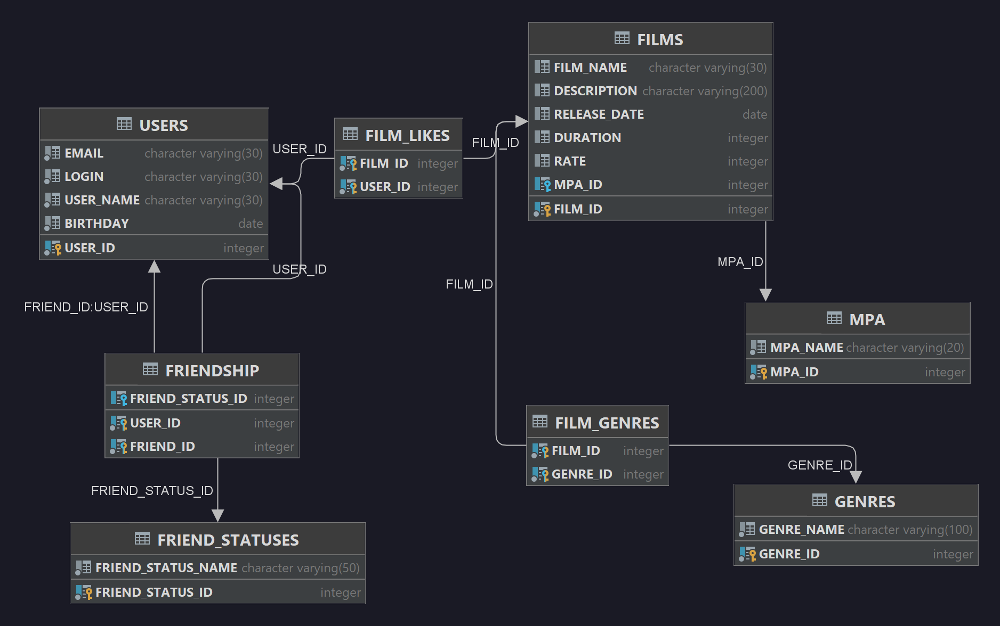

# java-filmorate
Template repository for Filmorate project.

# **SQL request examples:**   

**createFilm**

"INSERT INTO FILMS(FILM_NAME, DESCRIPTION, " +
"RELEASE_DATE, DURATION, RATE, MPA_ID)"

**updateFilm**

"UPDATE FILMS " +
"SET FILM_NAME = ?, DESCRIPTION = ?, RELEASE_DATE = ?, DURATION = ?, RATE = ?, MPA_ID = ? " +
"WHERE FILM_ID = ?"

**addFriend**

"MERGE INTO FRIENDSHIP(USER_ID, FRIEND_ID, FRIEND_STATUS_ID)"

**getUserFriends**

" SELECT * " +
" FROM USERS AS U" +
" JOIN FRIENDSHIP AS F ON U.USER_ID = F.FRIEND_ID" +
" WHERE F.USER_ID = ?"

**getCommonFriends**

" SELECT * " +
" FROM USERS AS U " +
" JOIN FRIENDSHIP AS FU ON U.USER_ID = FU.FRIEND_ID " +
" JOIN FRIENDSHIP AS FO ON U.USER_ID = FO.FRIEND_ID " +
" WHERE FU.USER_ID = ? AND FO.USER_ID = ?"

**getPopularFilms**

String sqlQuery = "SELECT *" +
" FROM FILMS AS F" +
" LEFT OUTER JOIN FILM_LIKES AS Fl ON F.FILM_ID = Fl.FILM_ID" +
" GROUP BY F.FILM_ID" +
" ORDER BY COUNT(DISTINCT FL.USER_ID) DESC" +
" LIMIT ?"

**loadFilmGenres**

" SELECT * " +
" FROM GENRES AS GE" +
" LEFT OUTER JOIN FILM_GENRES AS FG ON GE.GENRE_ID = FG.GENRE_ID" +
" WHERE FILM_ID = ?"